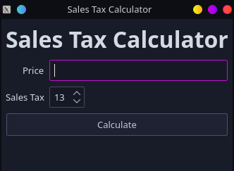

# Sales Tax Calculator with PyQT5
This is a PyQT5 program that calculates the total price of an item given its base price and the sales tax. This project was made to learn how to make a program with a GUI using QT Designer and PyQT5. 

QT Designer is a program that lets you drag and drop widgets onto your user interface. With that, you can save the project and connect it to a Python file. In the Python file, you can then program the logic to add functionality. 

Source of tutorial can be found [here](https://www.learnpyqt.com/examples/simple-sales-tax-calculator/)

